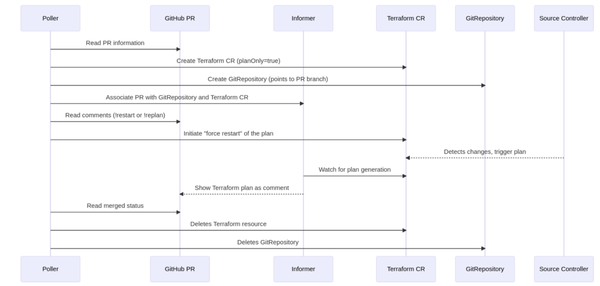

# Branch Planner Overview

The GitOps methodology streamlines infrastructure provisioning and management, using Git as the source of truth. The Branch Planner, a component of TF-Controller, aims to take this a step further by allowing developers and operations teams to plan Terraform configurations on a branch that's separate from the `main` branch. This makes it easier to review and understand the potential impact of your changes before you run `terraform apply`.

The Branch Planner's most important feature is its seamless integration with the PR (Pull Request) user interface. When changes are proposed on a new branch, Branch Planner runs a plan in the cluster and displays the results directly as comments under your PR. Once you're satisfied with the results, merge your branch into the `main` branch to trigger the TF-Controller. 

### How does it work?

When the Branch Planner is enabled through Helm values, it will watch all configured Terraform resources, check their referenced Source, and poll for Pull Requests using GitHub's API plus the provided token.

Upon starting, the Branch Planner polls repositories that contain Terraform resources at regular intervals in order to detect Pull Requests (PR) that change those resources. When the Branch Planner detects an open Pull Request, it either creates a new Terraform object or updates an existing one, applying Plan Only mode based on the original Terraform object for the corresponding branch. In this mode, TF-Controller generates Terraform plans but does not apply them. 

Once the plan is generated, Branch Planner posts the plan under the PR as a comment, enabling users to review the plan. When the Terraform files of the corresponding branch are updated, Branch Planner posts the updated plan under the PR as new comment, keeping the PR up-to-date with the latest Terraform plan.

### Replan commands

The Branch Planner also allows users to manually trigger the replan process. By simply commenting `!replan` under the PR, the Branch Planner will be instructed to generate a new plan and post it under the PR as a new comment.

Now that you know what Branch Planner can do for you, follow the [guide to get started](./branch-planner-getting-started.md).

