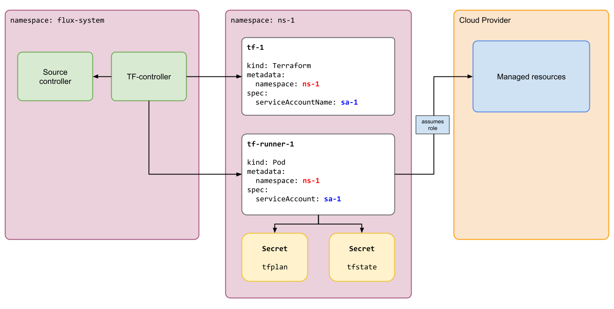

# Overview

~> **BREAKING NEWS:** The **Technology Preview** of the Branch Planner is now available! [Learn more](./branch-planner/index.md) or Get started with the [Branch Planner](./branch-planner/branch-planner-getting-started.md).

TF-controller is a reliable controller for [Flux](https://fluxcd.io) to reconcile Terraform resources
in the GitOps way.
With the power of Flux together with Terraform, TF-controller allows you to GitOps-ify infrastructure,
and application resources, in the Kubernetes and Terraform universe, at your own pace.

"At your own pace" means you don't need to GitOps-ify everything at once.

A high-level diagram of how TF-controller works is shown below:

TF-controller offers many GitOps models:

  1. **GitOps Automation Model:** GitOps your Terraform resources from the provision steps to the enforcement steps, like a whole EKS cluster.
  2. **Hybrid GitOps Automation Model:** GitOps parts of your existing infrastructure resources. For example, you have an existing EKS cluster.
     You can choose to GitOps only its nodegroup, or its security group.
  3. **State Enforcement Model:** You have a TFSTATE file, and you'd like to use GitOps enforce it, without changing anything else.
  4. **Drift Detection Model:** You have a TFSTATE file, and you'd like to use GitOps just for drift detection, so you can decide to do things later when a drift occurs.

To get started, follow the [getting started](./getting_started.md) guide.

## Features

  * **Multi-Tenancy**: TF-controller supports multi-tenancy by running Terraform `plan` and `apply` inside Runner Pods.
    When specifying `.metadata.namespace` and `.spec.serviceAccountName`, the Runner Pod uses the specified ServiceAccount
    and runs inside the specified Namespace. These settings enable the soft multi-tenancy model, which can be used within
    the Flux multi-tenancy setup. _This feature is available since v0.9.0._
  * **GitOps Automation for Terraform**: With setting `.spec.approvePlan=auto`, it allows a `Terraform` object
    to be reconciled and act as the representation of your Terraform resources. The TF-controller uses the spec of
    the `Terraform` object to perform `plan`, `apply` its associated Terraform resources. It then stores
    the `TFSTATE` of the applied resources as a `Secret` inside the Kubernetes cluster. After `.spec.interval` passes,
    the controller performs drift detection to check if there is a drift occurred between your live system,
    and your Terraform resources. If a drift occurs, the plan to fix that drift will be generated and applied automatically.
    _This feature is available since v0.3.0._
  * **Drift detection**: This feature is a part of the GitOps automation feature. The controller detects and fixes drift
    for your infrastructures, based on the Terraform resources and their `TFSTATE`. _This feature is available since v0.5.0._
    * Drift detection is enabled by default. You can use the field `.spec.disableDriftDetection` to disable this behaviour.
      _This feature is available since v0.7.0._
    * The Drift detection only mode, without plan or apply steps, allows you to perform read-only drift detection.
      _This feature is available since v0.8.0._
  * **Plan and Manual Approve**: This feature allows you to separate the `plan`, out of the `apply` step, just like
    the Terraform workflow you are familiar with. A good thing about this is that it is done in a GitOps way. When a plan
    is generated, the controller shows you a message like **'set approvePlan: "plan-main-123" to apply this plan.'**.
    You make change to the field `.spec.approvePlan`, commit and push to tell the TF-controller to apply the plan for you.
    With this GitOps workflow, you can optionally create and push this change to a new branch for your team member to
    review and approve too. _This feature is available since v0.6.0._
  * **First-class YAML-based Terraform**: The `Terraform` object in v0.13.0+ allows you to better configure your 
    Terraform resources via YAMLs, but without introducing any extra CRDs to your cluster. Together with a new generator
    called **Tofu-Jet**, we'll now be able to ship pre-generated primitive Terraform modules for all major cloud providers.
    A primitive Terraform module is a module that only contains a single primitive resource, like `aws_iam_role`, or `aws_iam_policy`.
    With this concept, we would be able to use Terraform without writing Terraform codes, and make it more GitOps-friendly at the same time. 
    _This feature is available since v0.13.0._
  * **GitOps Dependency for Terraform**: The `Terraform` object in v0.13.0+ allows you to specify a list of `Terraform` objects
    that it depends on. The controller will wait for the dependencies to be ready before it starts to reconcile the
    `Terraform` object. This allows you to create a dependency graph of your Terraform modules, and make sure
    the modules are applied in the correct order. Please use `.spec.retryInterval` (a small value like `20s`) to control 
    the retry interval when using this feature. _This feature is available since v0.13.0._

## Support Matrix

| Version | Terraform | Source Controller | Flux v2 |
|:-------:|:---------:|:-----------------:|:-------:|
|  v0.15  |  v1.3.9   |      v1.0.x       | v2.0.x  |
|  v0.14  |  v1.3.9   |      v0.31.0      | v0.41.x |
|  v0.13  |  v1.3.1   |      v0.31.0      | v0.36.x |
|  v0.12  |  v1.1.9   |      v0.26.1      | v0.32.x |
